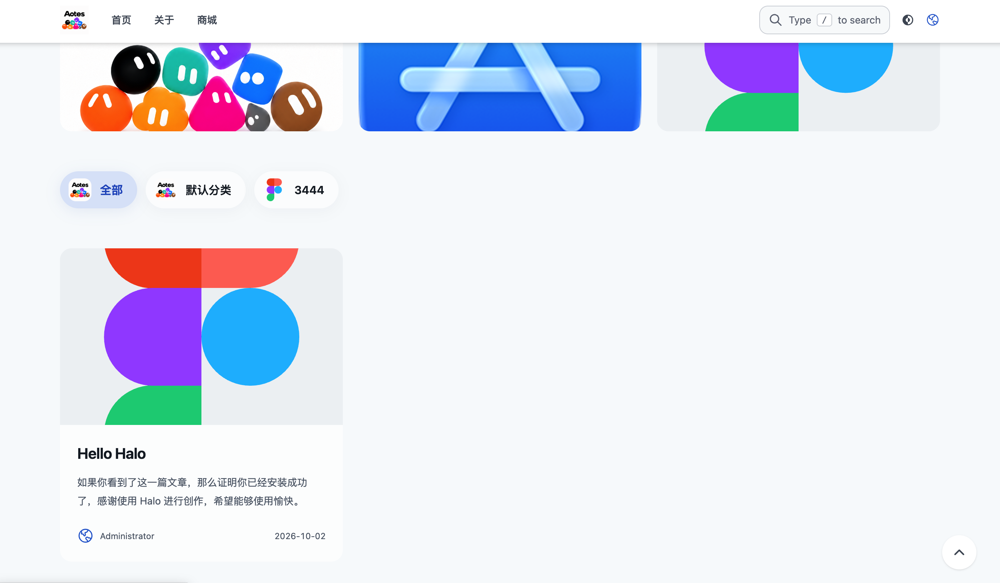
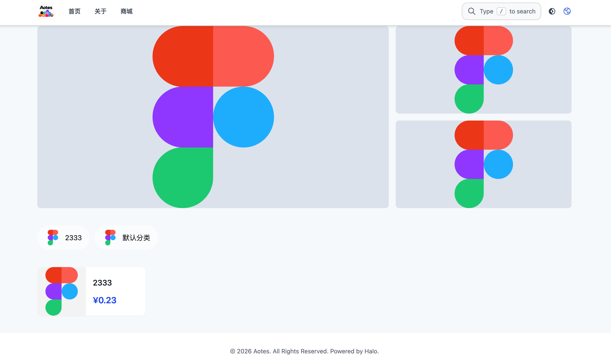
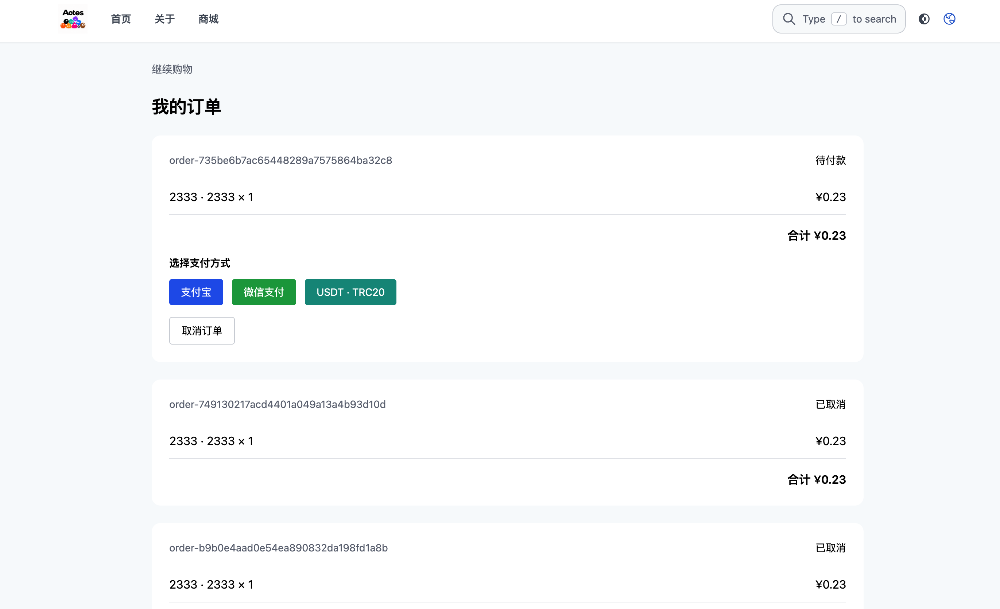

# AOSTE 主题与商城

AOSTE 是一款用于 Halo 的网站主题，适合展示文章，也可以搭配随包提供的商城插件使用。首页内容可以在 Halo 后台按自己的需要调整，不必修改代码。

在线体验：[https://halo-deve.txsw.top](https://halo-deve.txsw.top)

## 下载包里有什么

下载 `AOSTE-1.18.0-with-commerce-plugin.zip` 后，请先在电脑上解压。里面有两个需要分别安装的文件：

- `theme-aoset-1.18.0.zip`：AOSTE 网站主题。
- `plugin-commerce-0.1.0-SNAPSHOT.jar`：商城插件。

外层压缩包只是把主题和插件放在一起，不能直接作为一个主题上传。

## 安装前

请使用 Halo 2.26 或更高版本。商城插件需要 Halo 2.26 及以上版本；本组合包按这个版本要求准备。

## 安装步骤

1. 下载组合包并解压。
2. 在 Halo 后台打开「插件」，上传 `plugin-commerce-0.1.0-SNAPSHOT.jar`，安装并启用商城插件。
3. 打开「外观 → 主题」，上传 `theme-aoset-1.18.0.zip`，然后启用 AOSTE。
4. 进入主题的「首页布局」，配置首页内容并保存。

主题和插件是两个独立的安装项。只安装主题可以使用主题页面；需要商城功能时，还要安装并启用商城插件。

## 提交应用市场审核

主题审核请上传解压得到的 `theme-aoset-1.18.0.zip`。这是可安装的主题文件，应用类型为 `Theme`，唯一标识为 `theme-aoset`。

商城插件是另一个独立应用，类型为 `Plugin`，唯一标识为 `commerce`。需要上架插件时，请单独创建插件应用并上传 JAR 文件。主题 ZIP 与插件 JAR 不要放在同一个应用版本的制品列表中。

## 首页可以这样设置

首页由四个区块组成，可在「首页布局」里分别设置是否显示：

- **幻灯片**：添加图片、设置展示高度、自动播放和图片点击后的跳转地址。
- **自定义卡片**：添加图片、GIF 或视频，设置卡片尺寸、显示数量和点击后的链接。
- **文章分类**：选择要展示的分类并设置胶囊按钮图片。访客点击分类后，首页下方的文章列表会随之筛选；「全部」按钮也可以单独设置图片。
- **文章卡片列表**：展示 Halo 中的文章。文章布局和每页数量沿用 Halo 的文章相关设置。

首页分类按钮负责筛选首页文章，不会把访客带离首页。

## 页面预览

**首页分类筛选与文章卡片**

**商城商品与分类**

**商城订单与支付方式**

## 关于商城和支付

商城页面由配套插件提供。启用插件后，可按站点需要配置商品和订单。在线支付还需要你自己准备并填写支付网关信息；组合包不包含商户账号或支付密钥。正式开放前，建议先在自己的站点检查商品展示、下单和支付配置。

## 反馈与源码

如果遇到问题或想查看项目源码，可以前往 [AOSTE 项目与问题反馈页](https://github.com/cnmbdb/halo)。
